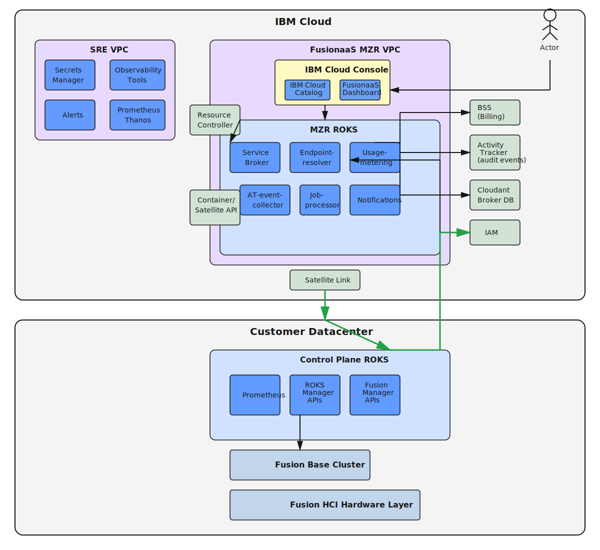

---

copyright:
 years: 2024, 2026
lastupdated: "2026-06-25"

keywords: fusion as a service, fusion, fully managed openshift, on-premises, cloud consumption pricing, ibm sre, gpu workloads, ai workloads

subcollection: cephaas

---
{{site.data.keyword.attribute-definition-list}}

# What is IBM Fusion as a service?
{: #about-fusionaas}

IBM Fusion as a service (Fusion) is IBM's fully managed Red Hat OpenShift on IBM Cloud Satellite platform delivered on-premises with cloud-like consumption and operational models. It combines the power of Red Hat OpenShift with IBM's enterprise-grade infrastructure management, allowing you to run containerized workloads in your own data center while benefiting from cloud economics and IBM Site Reliability Engineering (SRE) expertise.
{: shortdesc}

Fusion extends the IBM Fusion experience to a fully IBM-managed service that allows you to self-service provision OpenShift clusters, deploy applications, and consume storage and data services with cloud-like elasticity and a pay-for-what-you-use model—all while maintaining data sovereignty and meeting regulatory requirements for on-premises deployment.

## How IBM Fusion as a service works
{: #how-fusionaas-works}

With Fusion, IBM delivers, installs, and operates Red Hat OpenShift infrastructure in your data center. You retain physical control of your data and infrastructure while IBM handles the operational complexity:

- **IBM-owned infrastructure**: IBM provides and maintains the hardware, including optimized racks, servers, storage, networking switches, and integrated software that connects to {{site.data.keyword.cloud_notm}}.
- **Fully managed operations**: IBM SRE teams handle installation, configuration, monitoring, patching, upgrades, and day-to-day operations of the platform.
- **Self-service provisioning**: You provision OpenShift clusters, deploy workloads, and manage applications through familiar {{site.data.keyword.cloud_notm}} interfaces and APIs.
- **Flexible subscription terms**: Choose from 3-year, 4-year, or 5-year subscription terms with cost savings for longer commitments, eliminating large upfront capital expenditures while providing predictable operational expenses.

## Architecture
{: #fusionaas-architecture}

Fusion delivers a fully managed Red Hat OpenShift platform with an architecture designed for enterprise-grade performance, security, and operational efficiency. The architecture consists of several key layers that work together to provide a seamless on-premises cloud experience.

{: caption="Fusion architecture overview" caption-side="bottom"}

### Architecture components
{: #architecture-components}

The Fusion architecture includes the following key components:

IBM Cloud control plane
:   Provides centralized management, monitoring, and orchestration capabilities through the Fusion MZR VPC. The control plane includes the IBM Cloud Console with the Fusion Dashboard and Catalog, along with service components for endpoint resolution, usage metering, job processing, and notifications. The SRE VPC contains observability tools, Secrets Manager, Prometheus Thanos, and alerting systems that enable IBM SRE teams to manage the platform while you maintain data sovereignty.

Satellite Link
:   Establishes secure, encrypted connectivity between the IBM Cloud control plane and your on-premises infrastructure. This connection enables remote management and monitoring while keeping your application data within your datacenter.

Control Plane 
:   The on-premises Red Hat OpenShift on IBM Cloud Satellite control plane that manages your Red Hat OpenShift clusters. It includes ROKS Manager APIs for cluster lifecycle management, Fusion Manager APIs for infrastructure operations, and Prometheus for local monitoring and metrics collection.

Fusion Base Cluster
:   The foundational Red Hat OpenShift cluster that provides core platform services and serves as the management layer for your workload clusters. This cluster hosts essential services and operators required for the Fusion platform.

Fusion HCI Hardware Layer
:   IBM-owned and managed hyperconverged infrastructure deployed in your datacenter. This layer includes optimized compute servers, integrated storage systems, and networking equipment that provide the physical resources for your OpenShift clusters and workloads.

External integrations
:   Fusion integrates with IBM Cloud services including BSS for billing and usage tracking, Activity Tracker for audit events, Cloudant Broker DB for service broker data, IAM for identity and access management, and Resource Controller for resource lifecycle management.

## Getting started with IBM Fusion as a service
{: #fusionaas-next-steps}

To begin your Fusion journey:

1. **Request consultation**: Configure your requirements in the {{site.data.keyword.cloud_notm}} catalog and submit a consultation request to discuss your specific needs with IBM experts who will provide customized pricing.
2. **Prepare your data center**: Review the [prerequisites for installing Fusion](/docs/cephaas?topic=cephaas-pre_installation_checklist) to ensure your facility meets requirements.
3. **Deploy**: Work with IBM to install and configure Fusion in your data center.

For detailed information on getting started, see [Getting started with IBM Fusion as a service](/docs/cephaas?topic=cephaas-getting-started).

## Related information
{: #fusionaas-related}

- [Getting started with IBM Fusion as a service](/docs/cephaas?topic=cephaas-getting-started)
- [Preparing your data center](/docs/cephaas?topic=cephaas-pre_installation_checklist)

