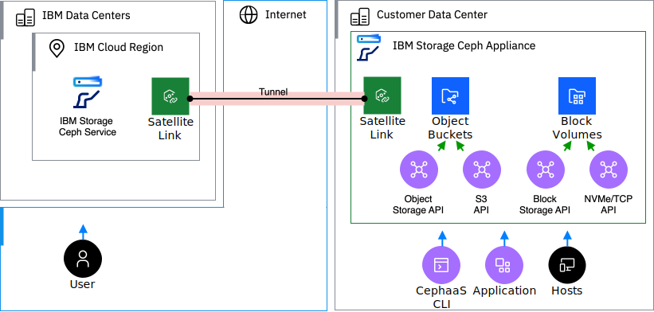

---

copyright:
  years: 2024
lastupdated: "2025-10-30"

keywords: cephaas, architecture, workload isolation levels, ceph as a service

subcollection: cephaas

---

{{site.data.keyword.attribute-definition-list}}

# Architecture and workload isolation of {{site.data.keyword.cephaas_full_notm}}
{: #compute-isolation}

{{site.data.keyword.cephaas_full}} is a hardware appliance hosted in your datacenter and remotely managed for you by IBM.

Review the following sample architecture for {{site.data.keyword.cephaas_full_notm}}, and learn more about how your data is isolated from other workloads.
{: shortdesc}

## {{site.data.keyword.cephaas_full_notm}} architecture
{: #architecture}

The following diagram describes the default components that are set up in an {{site.data.keyword.cephaas_full}} architecture.

{: caption="Architecture of {{site.data.keyword.cephaas_full_notm}}" caption-side="bottom"}

## {{site.data.keyword.cephaas_full_notm}} workload isolation
{: #workload-isolation}

Each {{site.data.keyword.cephaas_full_notm}} deployment instance manages one appliance which is located within your datacenter. The service lifecycle and access operations and APIs are managed within your {{site.data.keyword.cloud_notm}} account and is not accessible to any other {{site.data.keyword.cloud_notm}} account. All data management and access APIs are accessible within your datacenter and are not remotely accessible.

IBM Cloud Satellite is used to communicate between the IBM Cloud management services and the appliance.  This connection is encrypted and isolated to each appliance instance.
