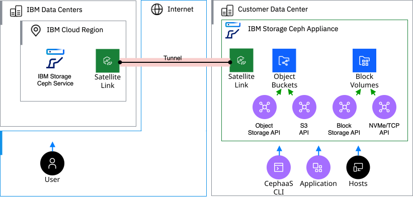

---

copyright:
  years: 2024
lastupdated: "2026-07-07"

keywords: cephaas, architecture, workload isolation levels, ceph as a service

subcollection: cephaas

---

{{site.data.keyword.attribute-definition-list}}


# Architecture and workload isolation of {{site.data.keyword.cephaas_full_notm}}
{: #compute-isolation}

{{site.data.keyword.cephaas_full}} is a hardware appliance hosted in your datacenter and remotely managed for you by IBM.

Review the following sample architecture for {{site.data.keyword.cephaas_full_notm}}, and learn more about how your data is isolated from other workloads.
{: shortdesc}

## {{site.data.keyword.cephaas_full_notm}} architecture
{: #architecture}

The following diagram describes the default components that are set up in an {{site.data.keyword.cephaas_full}} architecture.

{: caption="Architecture of {{site.data.keyword.cephaas_full_notm}}" caption-side="bottom"}

The architecture consists of the following key layers:

```text
┌──────────────────────────────────────────────────────────────┐
│                    Fusion as a Service                       │
│                                                              │
│  Manage and consume OpenShift infrastructure, storage,       │
│  and AI-ready resources through a unified experience.        │
└──────────────────────────────────────────────────────────────┘
                           │
                           ▼
        ┌───────────────────────────────────────┐
        │       Management & Operations         │
        │                                       │
        │  Cluster Mgmt • IAM • Monitoring      │
        │  Quotas • Metering • Automation       │
        └───────────────────────────────────────┘
                           │
                           ▼
        ┌───────────────────────────────────────┐
        │      Fusion Data Foundation           │
        │         Managed Storage Layer         │
        └───────────────────────────────────────┘
                           │
                           ▼
  ┌──────────────┐ ┌──────────────┐ ┌──────────────┐
  │ OpenShift    │ │ OpenShift    │ │ OpenShift    │
  │ Workloads    │ │ AI Apps      │ │ GPU Workloads│
  └──────────────┘ └──────────────┘ └──────────────┘
```
{: screen}

### Architecture layers
{: #architecture-layers}

Fusion as a Service
:   The top-level service layer that provides a unified experience for managing and consuming OpenShift infrastructure, storage, and AI-ready resources.

Management & Operations
:   Handles cluster management, Identity and Access Management (IAM), monitoring, quotas, metering, and automation capabilities.

Fusion Data Foundation
:   The managed storage layer that provides persistent storage services for the platform.

Workload Layer
:   Supports various types of workloads including standard OpenShift workloads, AI applications, and GPU-accelerated workloads.

## {{site.data.keyword.cephaas_full_notm}} workload isolation
{: #workload-isolation}

Each {{site.data.keyword.cephaas_full_notm}} deployment instance manages one appliance which is located within your datacenter. The service lifecycle and access operations and APIs are managed within your {{site.data.keyword.cloud_notm}} account and is not accessible to any other {{site.data.keyword.cloud_notm}} account. All data management and access APIs are accessible within your datacenter and are not remotely accessible.

IBM Cloud Satellite is used to communicate between the IBM Cloud management services and the appliance.  This connection is encrypted and isolated to each appliance instance.
