---

copyright:
 years: 2024, 2026
lastupdated: "2026-02-03"

keywords: cephaas settings, trial version, ceph as a service

subcollection: cephaas

---

{{site.data.keyword.attribute-definition-list}}

# Deploying a virtual machine
{: #deploy-vm} 

This section provides step-by-step instructions to deploy a virtual machine (VM) using a pre-configured template from the content library. By following these steps, you can set up a functional VM with appropriate storage and networking configurations, enabling direct access from your local machine.

1. Open the **vSphere Client** user interface.

2. Right-click on **Trials Datacenter** and select **New Virtual Machine**.

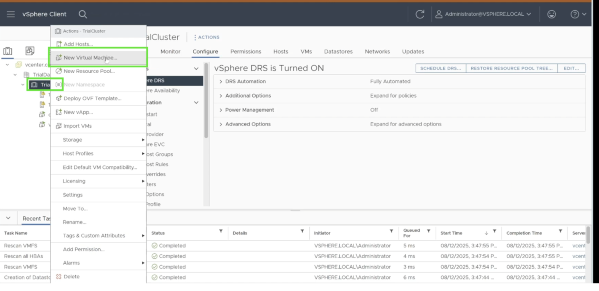{: caption="New Virtual Machine" caption-side="bottom"}

3. In the deployment wizard, choose **Deploy From Template**.

{: caption="Deploy From Template" caption-side="bottom"}

4. Select the **trials-workload-vm** template from the **Trials Content Library**.

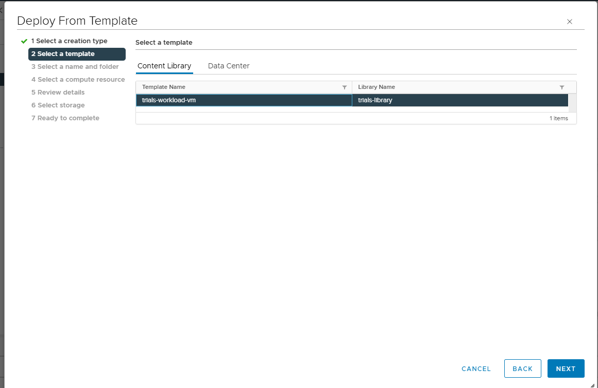{: caption="Deploy From Template" caption-side="bottom"}

5. On the **Select A Name And Folder** screen, enter a name for the virtual machine and click **Next**.  
   > Do not modify the default location for the virtual machine.

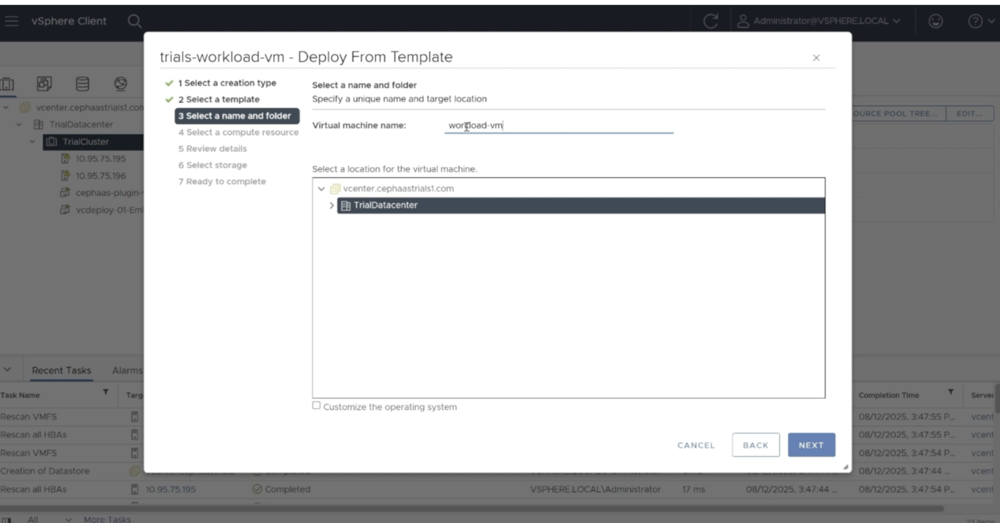{: caption="Select Name" caption-side="bottom"}

6. On the **Select a compute resource** screen, ensure that **TrialCluster** is selected and click **Next**.

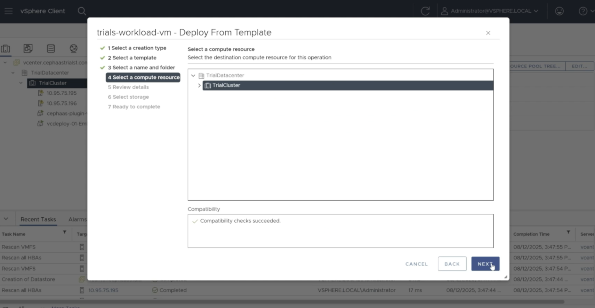{: caption="Select Compute Resource" caption-side="bottom"}

7. On the **Review details** screen, click **Next**.  

    You may see a warning related to advanced security options. It is safe to ignore this warning and proceed.
    {: note}

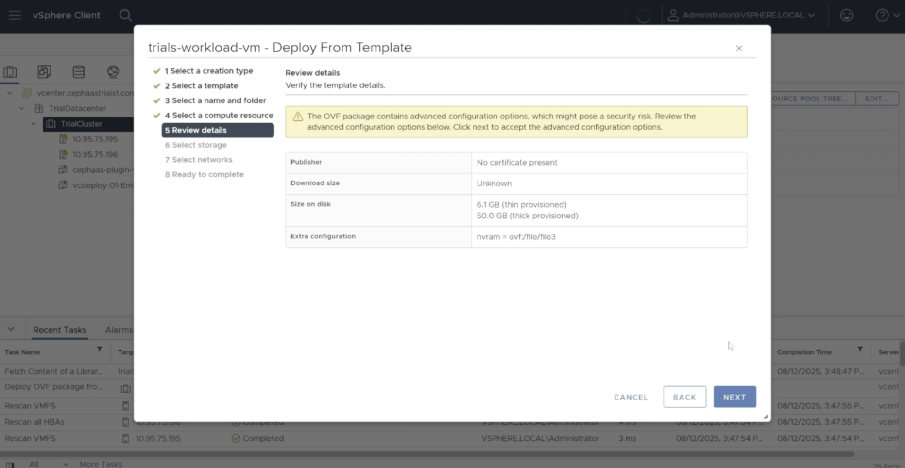{: caption="Review details" caption-side="bottom"}

8. On the **Select Storage** screen, choose the **DS1/DS2** datastore.

When selecting a database option, choose DS1 or DS2 as the location where the virtual machine (VM) will be installed. The datastore created by you will provide the storage required for your database workload.
{: note}

9. On the **Select networks** screen, click **Next** to proceed with the default network settings.

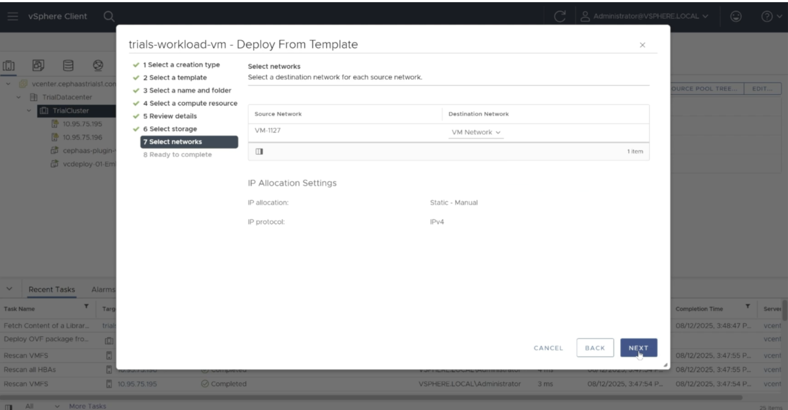{: caption="Select Networks" caption-side="bottom"}

10. On the **Ready to complete** screen, review your inputs and click **FINISH** to begin the deployment.

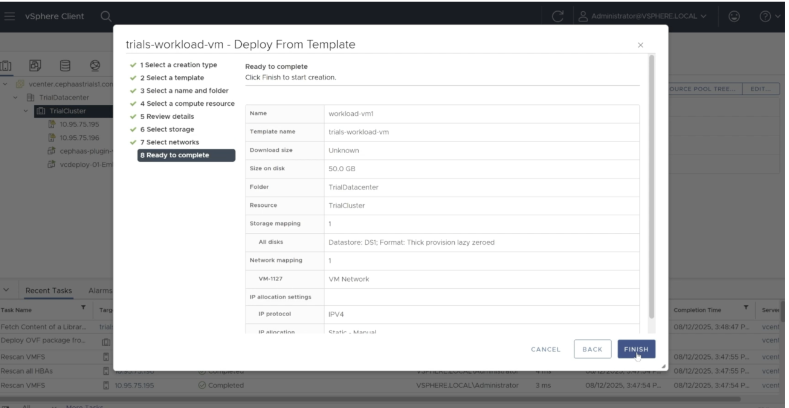{: caption="Ready to complete" caption-side="bottom"}

The deployment process may take a few minutes. You can monitor progress in the **Recent Tasks** panel at the bottom of the screen.

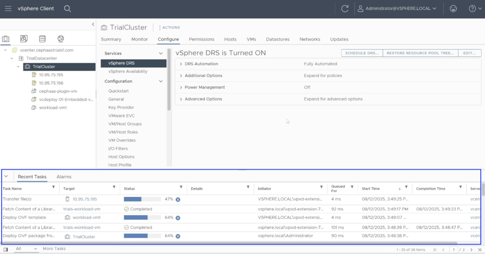{: caption="Deployment Process" caption-side="bottom"}

## Power on and network settings
{: #power-settings} 

1. Once the VM is deployed, select it from the left navigation pane and click **Power On**.

{: caption="Power on" caption-side="bottom"}

2. Click **Launch Web Console** to access the VM. Log in as the **root user** using the credentials provided in the instructions file shared earlier.

    You may see a **System Not Registered** warning.This is expected and can be safely ignored.
    {: note}

3. After logging in, click the **Configuration** button at the top right and navigate to **Wired Settings**.

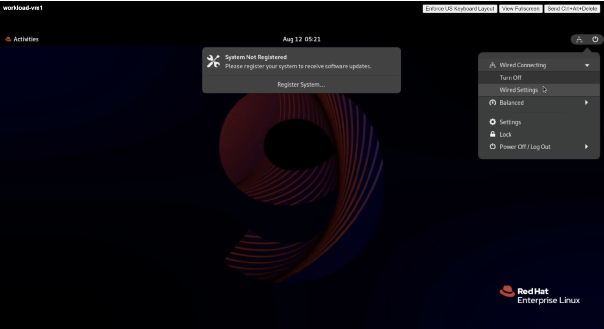{: caption="Wired Settings" caption-side="bottom"}

4. Click the **Settings** icon to edit the network configuration.

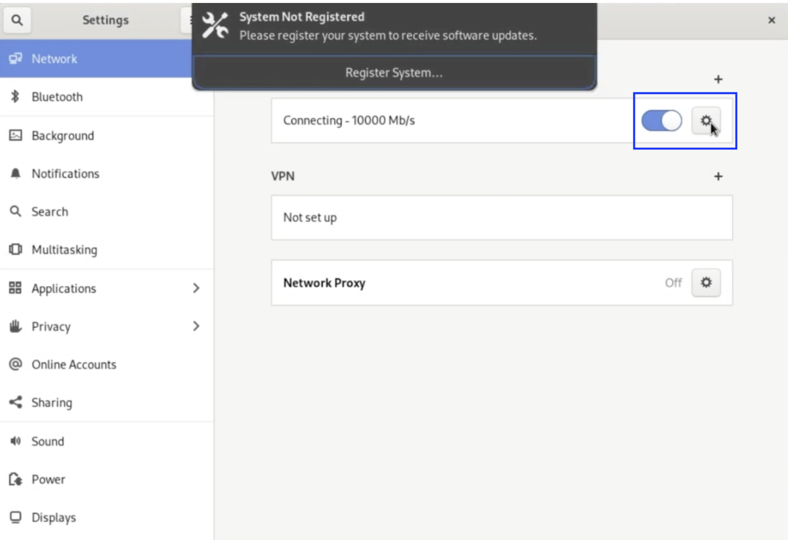{: caption="Network Settings" caption-side="bottom"}

5. Under **IPv4 Method**, select **Manual** and enter the network parameters provided in the setup instructions. Click **Apply** to save the changes.

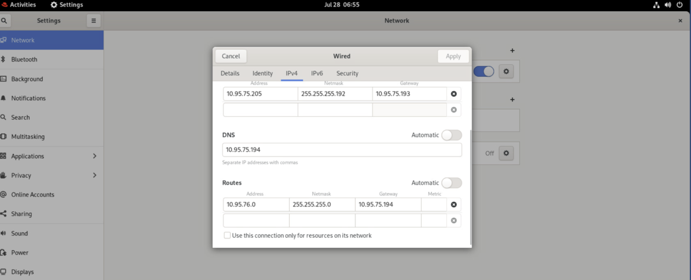{: caption="IPv4 network settings" caption-side="bottom"}

You have now successfully deployed a virtual machine using IBM Storage Ceph as a Service for the operating system disk and configured it with the required network connectivity.
