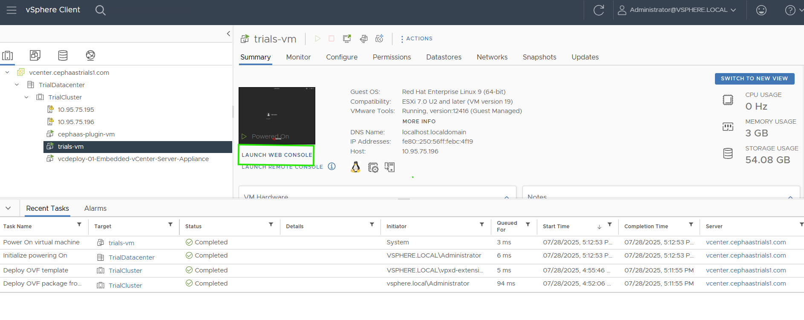
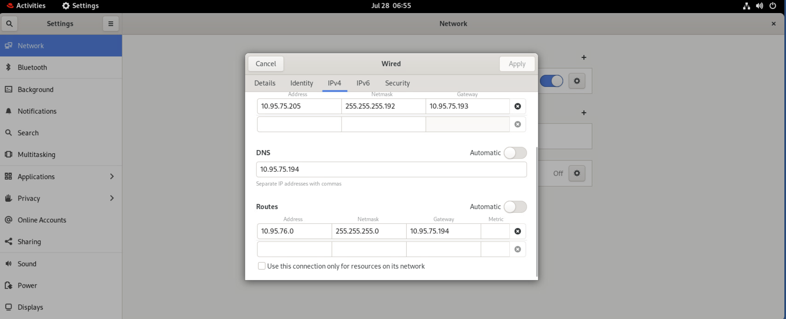

---

copyright:
 years: 2024, 2025
lastupdated: "2025-08-26"

keywords: cephaas settings, trial version, ceph as a service

subcollection: cephaas

---

{{site.data.keyword.attribute-definition-list}}

# Configuring a virtual machine from a template

This section provides step-by-step instructions to deploy a virtual machine (VM) using a pre-configured template from the content library. By following these steps, you can set up a functional VM with appropriate storage and networking configurations, enabling direct access from your local machine.

## Deploying the VM from the content library template

1. Open the vSphere Client and navigate to the **Content Library** to deploy the template VM.
2. Choose storage for the OS. 
2. Choose DS1/DS2 to use local ESXi storage or choose any NVMe datastore created. 
3. Start the VM, login to the VM using VMWare Web console using provided credentials.

    {: caption="VMWare Web console" caption-side="bottom"}

4. Configure the network settings using the credentials and parameters provided in the setup instructions. The setup instructions are provided in the setup zip file. 

    {: caption="Networking credentials" caption-side="bottom"}

5. After completing the configuration, verify connectivity by pinging and accessing the VM via SSH from your laptop.

