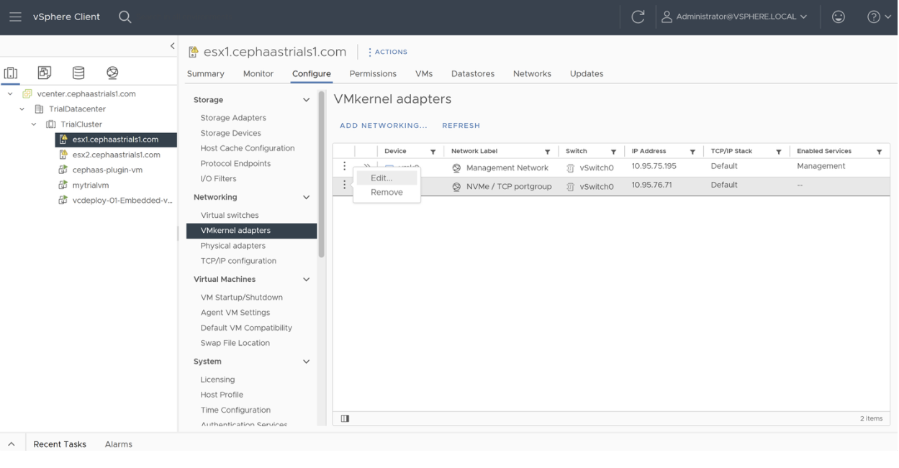
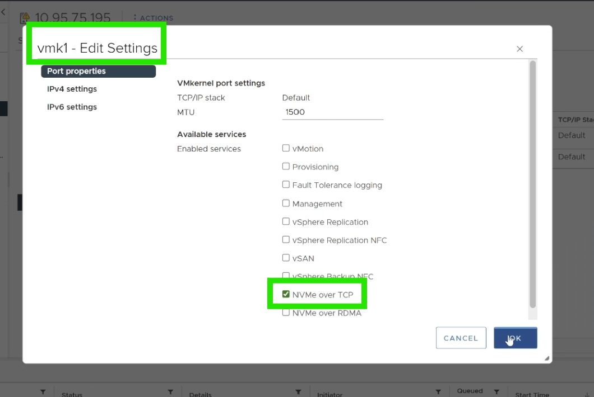
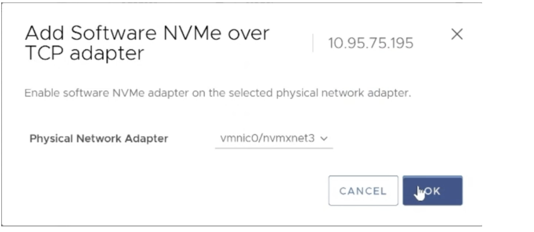

---

copyright:
 years: 2024, 2026
lastupdated: "2026-02-03"

keywords: cephaas settings, trial version, ceph as a service

subcollection: cephaas

---

{{site.data.keyword.attribute-definition-list}}

# Configuring VMware environment
{: #using-trial-version}

The trial experience uses a VMware-based compute infrastructure to consume storage provisioned through the {{site.data.keyword.cephaas_full_notm}} trial deployment.

## Accessing the VCenter appliance 
{: #trial-connect-to-vcenter}

Upon connecting to the VPN, you can access the VMware systems prepared for your trial using a web browser. Your vCenter URL is determined by the trial account you have been onboarded to. The trial account name is mentioned in the invitation email you received.
- CephaaS Customer Trial 1 - http://vcenter.cephaastrials1.com/
- CephaaS Customer Trial 2 - http://vcenter.cephaastrials2.com/
- CephaaS Customer Trial 3 - http://vcenter.cephaastrials3.com/

The credentials required to log in are included in the instructions file within the ZIP archive shared by your IBM representative.

When navigating to vCenter, you may see a “Your connection is not private” warning. This is expected behavior and does not indicate a security risk. You can safely ignore this warning.
{: note}

{{site.data.keyword.cephaas_full_notm}} trial runs on a VMware-based setup intended solely for evaluation purposes. You may encounter a VMware license expiration message during the trial period. This is expected and does not impact the functionality of the trial environment. Please note that this setup is not intended for production use.
{: note}

Copy-and-paste functionality is not supported in the VMware web remote console.
{: note}

## Preparing Host for NVMe/TCP Connectivity with IBM Cloud Block Storage
{: #trial-prepare-host-for-connectivity}

To connect the ESXi host to IBM Cloud Block Storage over NVMe/TCP, you must first enable NVMe/TCP services on the host.

To ensure proper connectivity, you must configure both ESXi hosts in your environment. Repeat all steps in this section for the second host after completing them for the first.
{: note}

### Enable NVMe/TCP on ESXi VMKernel Adapters
{: #trial-enable-nvme-on-adapters}

1. Open the vCenter user interface and use the navigation pane on the left to select the ESXi host that you want to configure.

    If the navigation pane is not visible by default, click the **menu icon** (hamburger menu) located at the top of the screen to expand the left navigation panel. Then, select **Inventory** to proceed.
    {: note}

2. Navigate to **Configure** > **VMKernel adapters**.
3. Select and edit the VMKernel adapter with the network label NVMe/TCP portgroup. 

    {: caption="Adding VMKernel adapter" caption-side="bottom"}

4. In the edit dialog, enable NVMe/TCP service. 

    {: caption="Adding VMKernel adapter" caption-side="bottom"}

5. Save the changes.
6. Repeat the above steps to enable the adapter on the second ESXi host.

### Add NVMe/TCP Storage Adapter
{: #trial-add-nvme-adapter}

1. With the same host selected, go to **Configure** > **Storage Adapters** in vCenter UI.
2. Select **ADD SOFTWARE ADAPTER** > **Add NVMe over TCP adapter**. 

    {: caption="Adding adapter" caption-side="bottom"}

3. Select the physical network adapter (NIC) vmnic0/nvmxnet3 for NVMe/TCP traffic in the dialog box. 

{: caption="Physical network adapter" caption-side="bottom"}

4. Repeat the above steps to enable the adapters on the second host.

