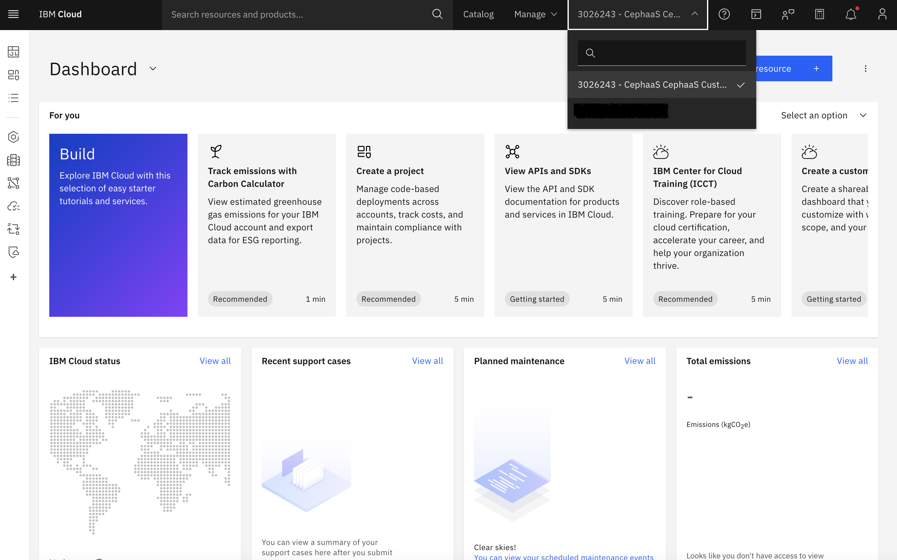
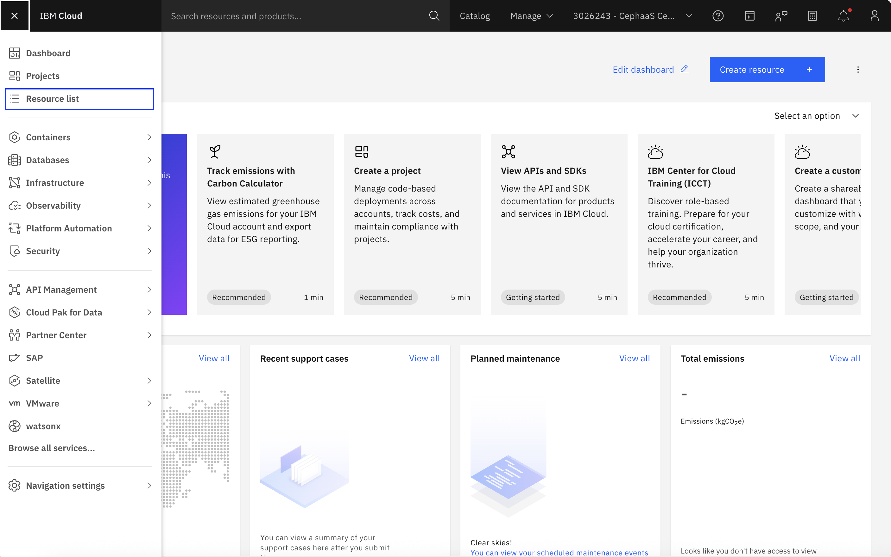
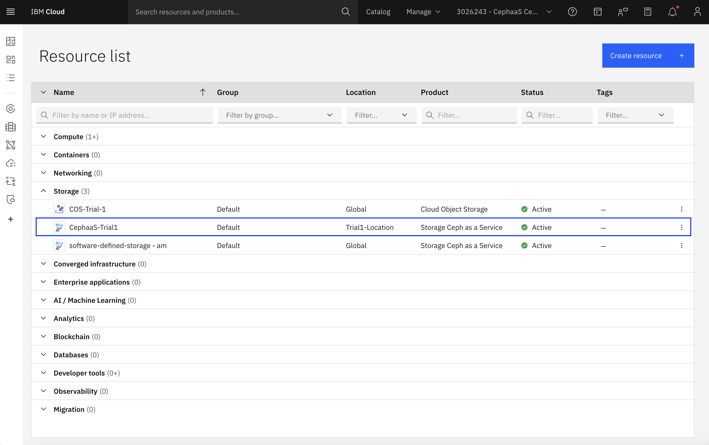
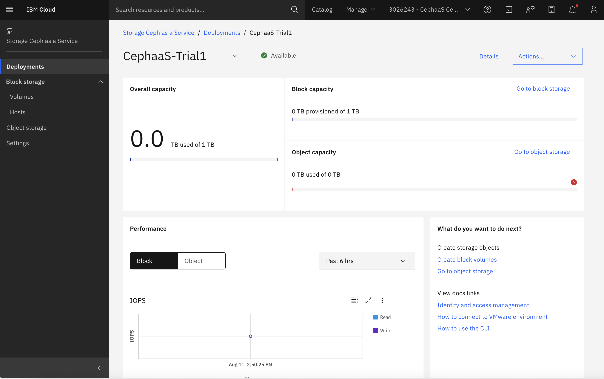

---

copyright:
 years: 2024, 2025
lastupdated: "2025-08-26"

keywords: cephaas settings, trial version, ceph as a service

subcollection: cephaas

---

{{site.data.keyword.attribute-definition-list}}

# Connecting to the trial environment
{: #trial-capabilities}

## Connecting to IBM Cloud VPN
{: #trial-connect-to-ibmcloud}

To securely access IBM Cloud resources during a trial, each new customer must connect through the IBM Cloud VPN. 

1. Download and install the latest version of OpenVPN client from https://openvpn.net/client/
2. Download the setup.zip file shared by your IBM representative.
3. Import the cephaas-trial-(n).ovpn file into OpenVPN software.
4. Connect to the VPN.

You will not require a password for the VPN connection as the connection is managed via client certificates. As part of the CephaaS trial setup, establishing a VPN connection is a trial-specific requirement. This ensures secure access to the VMware environment that has been provisioned exclusively for trial users. It is important to note that this VPN requirement does not apply to production deployments of IBM Storage for Ceph as a Service. In production environments, users can access their deployments directly without the need for a VPN.
{: note}

## Accessing your trials deployment
{: #trial-deployment}

After completing the onboarding process in IBM Cloud, follow these steps to access your CephaaS trial deployment:

1. Log in to the IBM Cloud Dashboard. 
2. If you are associated with multiple IBM Cloud accounts, ensure you are in the CephaaS trial account name mentioned in your email invitation. You can switch between the different cloud accounts using the by clicking on the account name in the menu bar at the top. 
{: caption="IBM Cloud Dashboard" caption-side="bottom"}
3. Go to the Resource List. 
{: caption="IBM Cloud Resource list" caption-side="bottom"}
4. Locate the Storage Section
{: caption="IBM Cloud Storage resources" caption-side="bottom"}
5. Under the Storage category, find and click on CephaaS-trials1.
6. Open the Deployment Dashboard.
{: caption="Trials Deployment" caption-side="bottom"}

This will take you to the deployment dashboard for your trial environment, where you can begin managing and configuring your resources.

