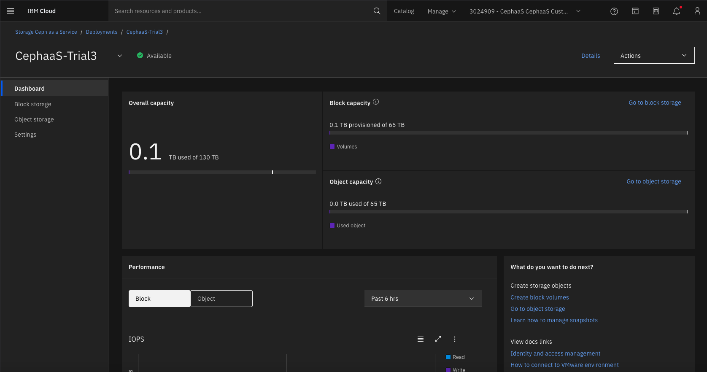

---

copyright:
 years: 2024, 2026
lastupdated: "2026-02-03"

keywords: cephaas settings, trial version, ceph as a service

subcollection: cephaas

---

{{site.data.keyword.attribute-definition-list}}

# Accessing the IBM Storage Ceph as a Service trial deployment
{: #trial-capabilities}

After completing the onboarding process in IBM Cloud, follow these steps to access your{{site.data.keyword.cephaas_full_notm}} trial deployment:

1. Log in to the [IBM Cloud Dashboard](https://cloud.ibm.com). 
2. If you are associated with multiple IBM Cloud accounts, ensure you are in the{{site.data.keyword.cephaas_full_notm}} trial account name mentioned in your email invitation. You can switch between the different cloud accounts using the by clicking on the account name in the menu bar at the top. 

    {: caption="IBM Cloud Dashboard" caption-side="bottom"}

3. Go to the Resource List. 

    {: caption="IBM Cloud Resource list" caption-side="bottom"}

4. Locate the Storage Section

    {: caption="IBM Cloud Storage resources" caption-side="bottom"}

5. Under the Storage category, find and click on CephaaS-trials1(2/3).
6. When accessing the dashboard for the first time, you will be welcomed with a **Welcome wizard**. The wizard is disabled since this is a trial environment. 

    {: caption="Trials Deployment" caption-side="bottom"}

The above UI is your {{site.data.keyword.cephaas_full_notm}} dashboard where you can view your storage capacity usage and performance metrics such as IOPS. This interface enables you to perform key storage operations, including:

- [Block volume operations](/docs/cephaas?topic=cephaas-block-storage-volume-about)  
- [Object storage operations](/docs/cephaas?topic=cephaas-about-object-storage)

In your trials, most key tasks are performed in the VMware environment rather than through the {{site.data.keyword.cephaas_full_notm}} UI. The VMware environment is going to be your primary consumption interface for the {{site.data.keyword.cephaas_full_notm}} trials.

The trial environment is provisioned with 1 TB of unified storage capacity, which can be used across both block and object storage services.
{: note}

