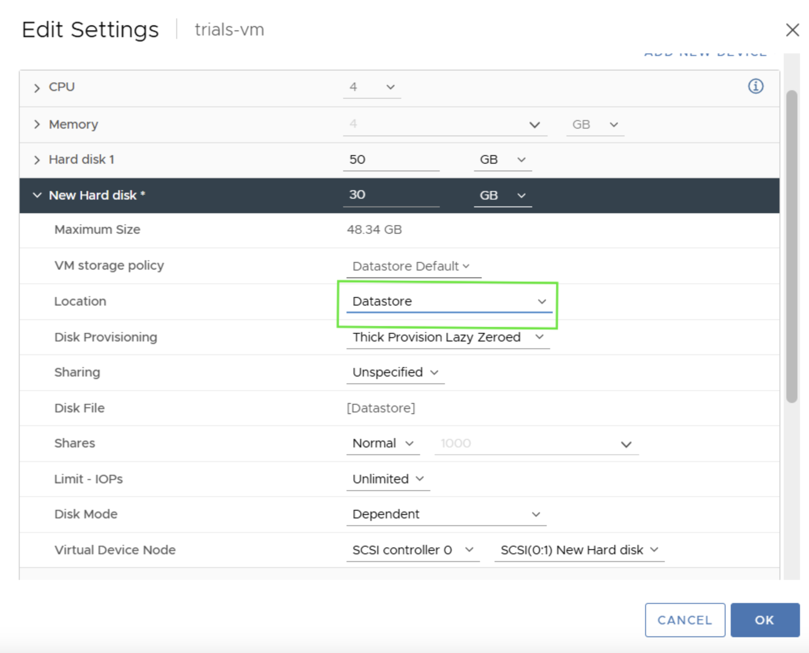
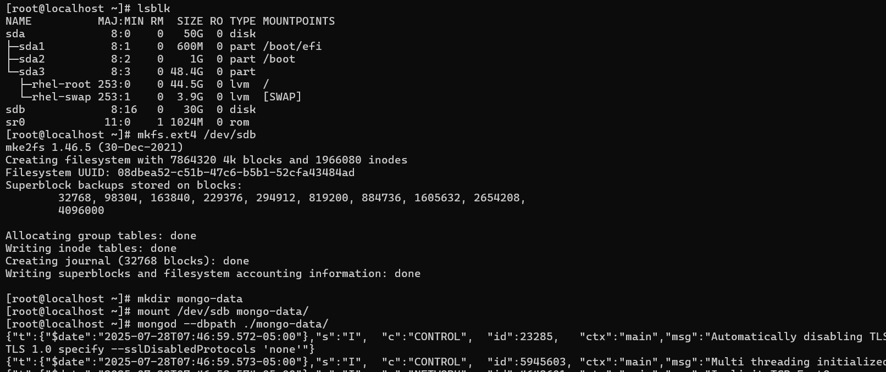

---

copyright:
 years: 2024, 2025
lastupdated: "2025-08-26"

keywords: cephaas settings, trial version, ceph as a service

subcollection: cephaas

---

{{site.data.keyword.attribute-definition-list}}

# Using IBM CephaaS block volume as VMware datastore

This section outlines how to prepare your VM for running a MongoDB workload using an NVMe-backed disk.

1. Add a new disk to the template VM, while taking storage from an NVMe Datastore.

{: caption="Adding a new disk from datastore" caption-side="bottom"}

2. Format the newly added disk using the root user, then use it as the data directory to run your MongoDB workload with the following commands as follows:

`lsblk`: For listing all block devices

`mkfs.ext4` <mount-point>: For formatting the block device to ext4 filesystem

`mkdir mongo-data`: For creating folder for mount

`mount <mount-point>  mongo-data`: For mounting the filesystem 

`mongod --dbpath ./mongo-data`: For starting mongodb with the given path

{: caption="formatting the disk" caption-side="bottom"}

