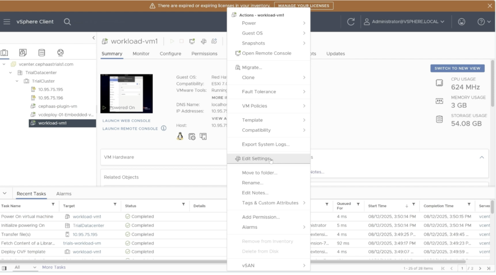
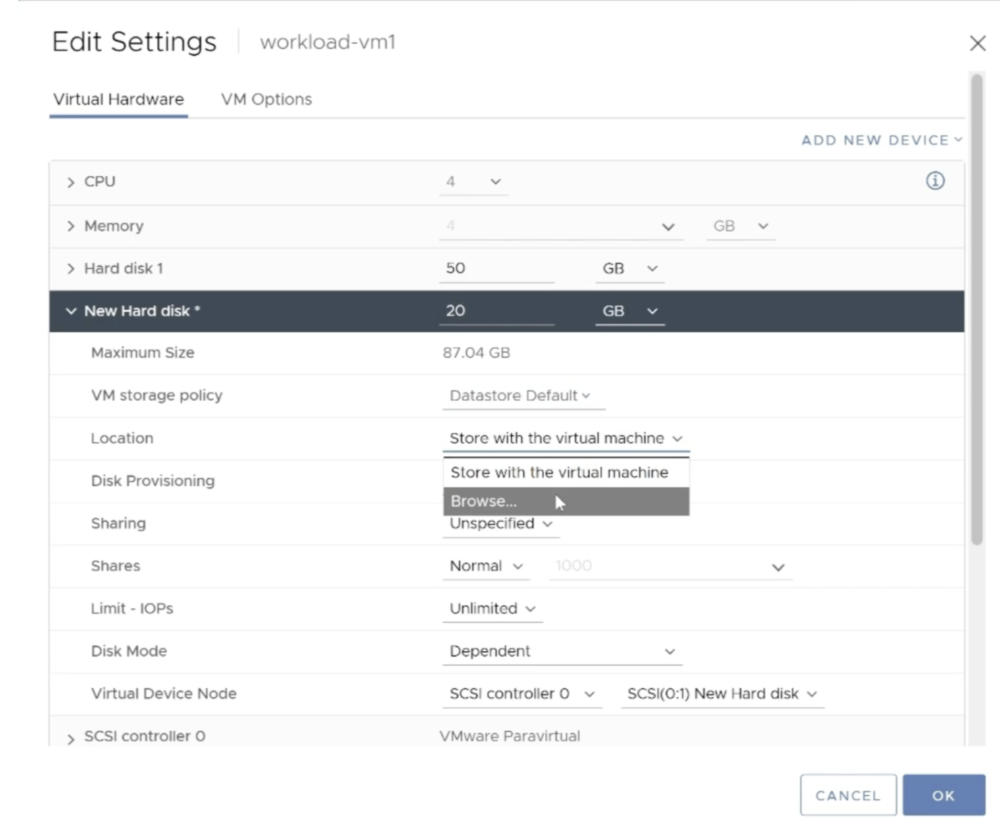

---

copyright:
 years: 2024, 2026
lastupdated: "2026-02-03"

keywords: cephaas settings, trial version, ceph as a service

subcollection: cephaas

---

{{site.data.keyword.attribute-definition-list}}

# Using {{site.data.keyword.cephaas_full_notm}} block volume as VMware datastore
{: #using-cephaas-mongo}

In this section, you will use block volume(s) from {{site.data.keyword.cephaas_full_notm}} to run a sample MongoDB workload.

## Adding a new disk to the virtual machine
{: #add-new-disk}

1. Log in to the **vSphere Client** and select the virtual machine deployed earlier from the navigation pane on the left.

2. From the VM details page on the right, navigate to **Actions** > **Edit Settings**.

    {: caption="Edit VM details" caption-side="bottom"}

3. Click **Add New Device** > **Hard Disk**.

4. Enter the desired size for the new hard disk and expand the configuration options.

5. Click the **Location** dropdown and select **Browse**.

    {: caption="Location settings" caption-side="bottom"}

6. Choose the datastore created earlier and click **OK**.

7. Click **OK** again to create the new disk.

    Disk creation may take a few minutes. You can monitor progress in the **Recent Tasks** panel at the bottom of the screen.
    {: note}

### Using the disk for MongoDB storage
{: #using-disk}

To run MongoDB on your virtual machine, you need to set up the newly attached block storage. This includes connecting to the VM, formatting the disk, mounting it, and pointing MongoDB to use it for data storage.

SSH (Secure Shell) is a secure way to connect to a remote system over the network. It encrypts communication so your login and commands stay safe. You can use SSH from your terminal in case of macOS or Linux and on Windows using PowerShell.
{: note}

1. SSH into the virtual machine as the root user using the credentials provided in the instructions file.

2. Format the newly added disk using the following commands:
   - `lsblk` – Lists all block devices
   - `mkfs.ext4 /dev /sdb` – Formats the block device with the ext4 file system

3. Prepare the disk for MongoDB by running:
   - `mkdir mongo-data` – Creates a directory for mounting
   - `mount /dev/sdb mongo-data` – Mounts the formatted disk to the directory
   - `mongod --fork --logpath /var/log/mongodb.log --dbpath ./mongo-data` – Starts MongoDB using the mounted directory as the data path

You have now successfully used a block volume from {{site.data.keyword.cephaas_full_notm}} within a virtual machine to run a sample MongoDB workload.

4. You can run the shell script to insert data into the mongodb database by running the following command in the /root folder:   `./insert_mongo_data.sh`.

In the steps above, we successfully demonstrated running a MongoDB workload using {{site.data.keyword.cephaas_full_notm}} block storage as the storage backend. This trial use case gives you a preview of how {{site.data.keyword.cephaas_full_notm}} can be used to leverage block storage for a database application like MongoDB.

When you deploy {{site.data.keyword.cephaas_full_notm}} in your data center, you can integrate your own applications and software to take advantage of block storage. This allows you to focus on consuming and utilizing storage resources, while we handle the provisioning and management of the storage infrastructure.
