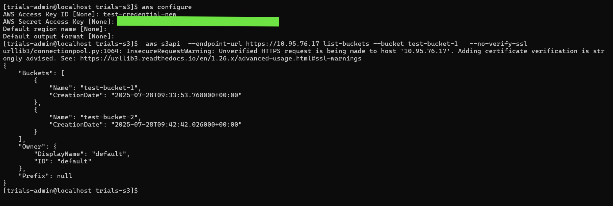

---

copyright:
 years: 2024, 2025
lastupdated: "2025-08-26"

keywords: cephaas settings, trial version, ceph as a service

subcollection: cephaas

---

{{site.data.keyword.attribute-definition-list}}

# Using IBM CephaaS Object Storage for Unstructured Data

Follow these steps to configure and access S3-compatible object storage from your deployed VM.

1. Use SSH to log in to your VM using the credentials provided during setup.
2. Generate object storage credentials using the [Object REST API](/docs/cephaas?topic=cephaas-creating-s3-credential-sds).
3. Copy the credential name and hmac access key.
4. Open AWS CLI and paste the credential name and hmac access key.
5. Run the following AWS S3 commands using the AWS CLI provided.

```sh
aws configure
```
{: pre}


```sh
aws s3api --enpoint-url https://<s3-ip> list-buckets --no-verify-ssl
```
{: pre}

{: caption="AWS CLI for S3 storage" caption-side="bottom"}

