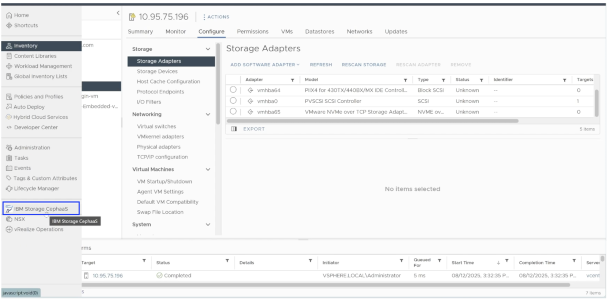
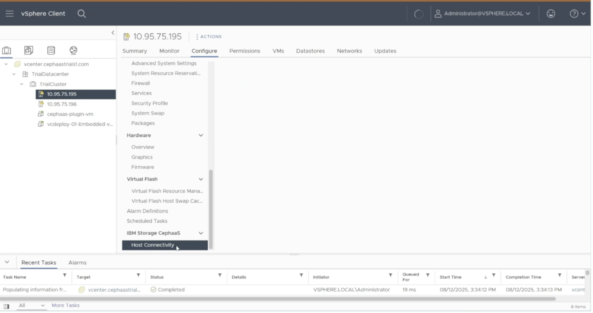
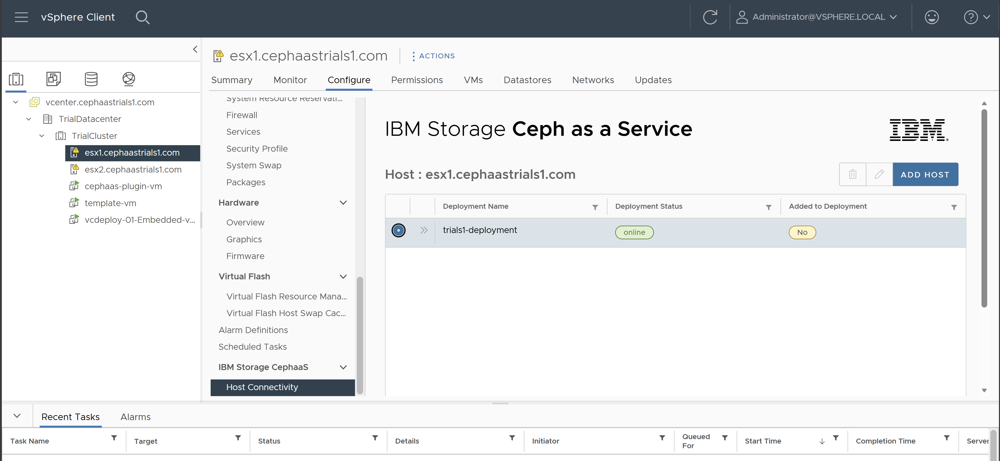
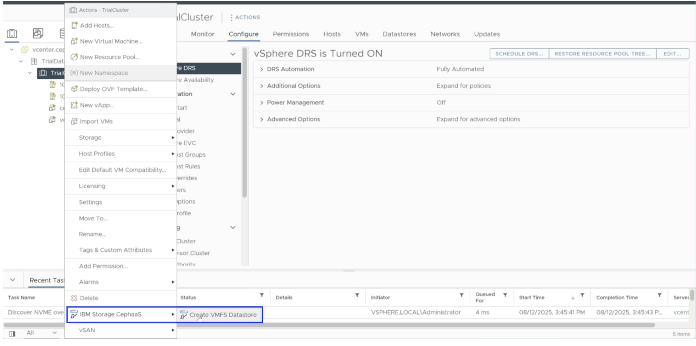

---
copyright:
 years: 2024, 2026
lastupdated: "2026-02-03"

keywords: cephaas settings, trial version, ceph as a service

subcollection: cephaas

---

{{site.data.keyword.attribute-definition-list}}

# Connecting the VMware environment to CephaaS storage
{: #cephaas-vmware-plugin}

After preparing your VMware environment to access NVMe/TCP storage, you can now connect it to the {{site.data.keyword.cephaas_full}} deployment provisioned for this trial. {{site.data.keyword.cephaas_full}}includes a vCenter plugin that simplifies this process through a few guided steps.

The vCenter plugin has been pre-installed in the trial environment. The following steps will help you configure and use the plugin to connect your VMware setup to the storage service. 
{: note}

Clipboard operations (copy and paste) are not supported in the vCenter UI. Make sure to manually enter any required values and record any information you need for later use.
{: important}

## Adding a deployment
{: #cephaas-add-dep-trial}

Before proceeding, ensure that you have the **Block endpoint FQDN** from the instructions file included in the ZIP archive shared by your IBM representative. You will also need to create an [IBM Cloud API key](/docs/account?topic=account-userapikey&interface=ui#create_user_key) by following the provided instructions. Copy or securely store your API key when it is generated as it is not saved in the system. If the API key is lost, you will need to generate a new key.
{: note}

1. Log in to the **vSphere Web Client**.
2. Navigate to **Main menu** → **IBM Storage CephaaS** to open the plug-in dashboard.

{: caption="Selecting IBM Storage CephaaS" caption-side="bottom"}

3. Click **ADD DEPLOYMENT**.
4. In the configuration screen, enter the following details:
   - **Block Endpoint FQDN**: Use the value obtained from the instructions file.
   - **API Key**: Enter the IBM Cloud API key you created earlier.
5. Click **Next** to continue.

6. On the **Deployment Details** screen, provide a name of your choice for the deployment and click **Next**.

7. Review the configuration summary and click **Add** to complete the setup.

You have now successfully connected vCenter to the IBM Storage Ceph as a Service instance for block storage consumption. Next, configure the individual ESXi hosts within your VMware cluster to enable block storage access. This is done by adding the ESXi hosts to the deployment you just created.

## Adding a new host
{: #cephaas-add-new-host}

Use the following steps to add an ESXi host to your deployment:

1. Expand the left navigation pane by clicking the **menu icon** (hamburger menu) at the top left of the screen.

2. Navigate to **Inventory** > **Datacenter** > **Cluster** > **Host** > **Configure** tab > **IBM Storage CephaaS** > **Host connectivity**.

    {: caption="Host Connectivity" caption-side="bottom"}

3. In the **Host Connectivity** section, select the deployment you created earlier and click **ADD HOST**.

    {: caption="Add Host" caption-side="bottom"}

4. Enter a host name of your choice (for example, TrialsHost1) and click **Add**.

5. Repeat the above steps to add the second host.

Once completed, both hosts will be configured to connect to {{site.data.keyword.cephaas_full}}.

## Adding a datastore
{: #adding-a-datastore}

Follow these steps to create a VMFS datastore using {{site.data.keyword.cephaas_full}}:

1. From the **vSphere Client** dashboard, expand the left navigation pane and locate the **TrialCluster** vSphere cluster.
2. Right-click the cluster and navigate to: **Actions** > **IBM Storage Ceph as a Service** > **Create VMFS datastore**

    {: caption="Add Datastore" caption-side="bottom"}

3. On the **Select Deployment** screen, choose the deployment you created earlier and click **Next**.

4. On the **Select Hosts** screen, select both ESXi hosts listed and click **Next**.

5. On the **Select Host Adapter** screen, choose the NVMe host adapter that was previously configured for each host, then click **Next**.

6. On the **Define Datastore** screen, enter the following:
   - **Name**: Specify a name for the datastore.
   - **Size**: Enter the desired size for the datastore.

    Enter a value less than 1024 GB in the **Size** field.
    {: note}

7. Review the configuration summary and click **Create** to complete the process.
